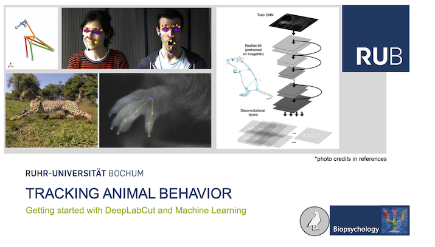

# Welcome

## Course Handbook
**This is the course handbook for the block seminar Tracking Animal Behavior at the Ruhr-University Bochum for the Winter Semester 2021/22.**

In the following pages we will discuss how we can track movement and what we mean by animal behavior. We will learn to use [DeepLabCut](https://github.com/DeepLabCut/DeepLabCut) to track labeled body parts from video data and analyze spatiotemporal dynamics to describe animal behavior.

You can access this handbook online from [GuillermoHidalgoGadea.com](https://guillermohidalgogadea.com/teaching/) or [GitHub](https://github.com/Guillermo-Hidalgo-Gadea/Seminar-TrackingAnimalBehavior), and download specific sections as pdf in the upper right corner.

:::{note}
The content of this book will be expanded and updated throughout the course!
:::

The content was developed by [Guillermo Hidalgo Gadea](https://GuillermoHidalgoGadea.com) and is available as open source educational ressource on [GitHub](https://github.com/Guillermo-Hidalgo-Gadea/Seminar-TrackingAnimalBehavior), licensed under the MIT License. 

## About Me
<iframe src="https://www.bio.psy.ruhr-uni-bochum.de/members_guillermo.html" frameborder="0.1" width="800" height="600"></iframe>

